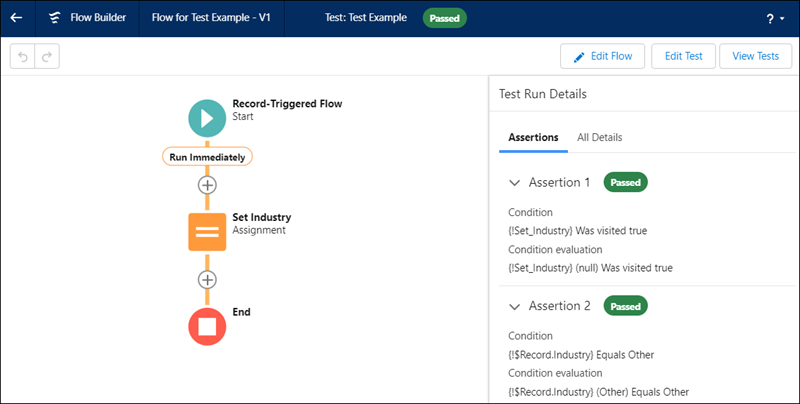

+++
title = 'Why you should use Apex instead of Flows in Salesforce'
date = 2024-03-12T12:34:07-04:00
draft = true
categories = ['salesforce', 'apex', 'flows']
keywords = ['salesforce', 'apex', 'apex class', 'apex trigger', 'flows', 'record triggered flow', 'lightning flow', 'declarative', 'programmatic', 'apex vs flows', 'triggers vs flows']
+++

Programmatic vs declarative solutions.

## Apex vs Flows
We've all heard the pitch. Flows are the declarative solution to automation in Salesforce. Flows are getting better with every release. Flows offer a low barrier to entry. Flows are so simple a child could make them. Flows saved my family and solved world hunger.

In most trainings, Flows are recommended as the go-to solution, with Apex as a secondary option if the logic becomes too complex. Salesforce even recently unveiled their new character, [Flo the Flying Squirrel](https://www.salesforce.com/blog/meet-salesforce-workflow-character-flo/), as a way of demonstrating their commitment to declarative tools. 

However, declarative automations are not a good pattern to design a system with. If given the option, an Engineer should always choose code.

There are use cases for Flows. If there isn’t a developer on hand, or there is a large legacy system, then code might not be an option. That being said, any software solution needs to be able to scale. For a company hoping to provide the smoothest transition, Salesforce solutions need to be designed by engineers from the start. Otherwise, it's set up for failure. 

## The Case for Apex
Engineers need to be allowed to engineer. This means using the best tools available, and Apex provides that. Let’s break down the reasoning.

### Handling Complex Logic
A small sales organization will not need much customization in Salesforce right away. Simple problems are easily solved by point-and-click tools. However, as time goes on and the organization grows, complexity compounds. Suddenly Salesforce needs to communicate with numerous external systems, process large batches of records, and perform complex SOQL queries, all of which Flows struggle to deliver.

Flows are often touted as easier to build, which is certainly true if you’re not a developer, but otherwise not necessarily. Valuable time can be wasted during a sprint trying to get a flow to handle a complex operation (such as processing many child records), only to eventually be abandoned and have the processing handled in an invocable Apex action. This extra development time can be avoided if the solution is designed in Apex from the beginning.

### Ease of Maintenance
If complex processes are built out in flows, then it quickly becomes difficult to maintain. Over time, flows might end up looking like this, which become a nightmare to debug:

As mentioned before, it might become necessary to move complex functionality from flows into Apex triggers. If so, automations are now handled in two different places and the order of execution needs to be considered to ensure expected outcomes still hold. With an absence of clear documentation, it can be cumbersome to figure out where certain business logic resides. 

It’s also very tedious to move elements from one flow to another in the event anything needs to be reorganized. With Apex, code can easily be designed to be reusable without significant development overhead.

### Tracking Changes
Version control is essential for any engineering team, Salesforce teams included. Flows have a versioning system, but it’s far from enough. Luckily, flow metadata can be checked into a git repository and tracked from there.

What’s the problem then?

The metadata is in xml, and not human readable. The only viable way to perform a code review on a Flow is to open it in a sandbox and view it in the UI. This isn’t feasible if it was developed in a scratch org, meaning the reviewer will have to do their best to read the xml or deploy it to their own scratch org. 

The problem is even worse if non-Salesforce developers are reviewing the change. A Java developer should be able to trace through Apex without much issue, but a Flow may be harder to parse without proper training.

### Writing Tests
Flows offer almost the same power as Apex but with a simpler learning curve, which is usually considered a positive. There’s a huge problem with this reasoning though. Apex code requires a minimum threshold of code coverage before deploying to production. Flows by default, do not.

If a tool can make external callouts to systems, reassign records, expose data, or any other number of high impact operations, there needs to be a certain level of security. Not to mention the reliability of a system that doesn't have standardized tests in place. [Declarative flow tests](https://help.salesforce.com/s/articleView?id=sf.flow_concepts_testing.htm&type=5) have recently been released, but they don’t replace the full functionality of Apex test classes. Most importantly, they're missing the ability to automatically run during a deployment. This is essential in any CI/CD process to ensure breaking changes are caught.

There is a way to [enforce flow test coverage](https://help.salesforce.com/s/articleView?id=release-notes.rn_forcecom_flow_mgmnt_coverage.htm&release=222&type=5) from Apex tests, which is highly recommended for any organization using flows. However, the fact that it’s not enabled by default is a big concern. A developer should be writing unit tests as soon as possible in the development process, so there’s no reason not to write the business logic in Apex as well. Salesforce themselves recommend a [test-driven development process](https://developer.salesforce.com/docs/atlas.en-us.apexcode.meta/apexcode/apex_testing_intro.htm), which is only feasible with Apex tests.

## Conclusion
Flows have their place in the Salesforce ecosystem, but when it comes to picking the right tool for the job, Apex comes out on top almost every time. Invest in developers early on and Salesforce is less likely to become bloated with poorly optimized automations. Software engineering teams should be encouraged to embrace code rather than avoid it.

 *If you have any comments or want to reach out, send me a message through one of my socials.*