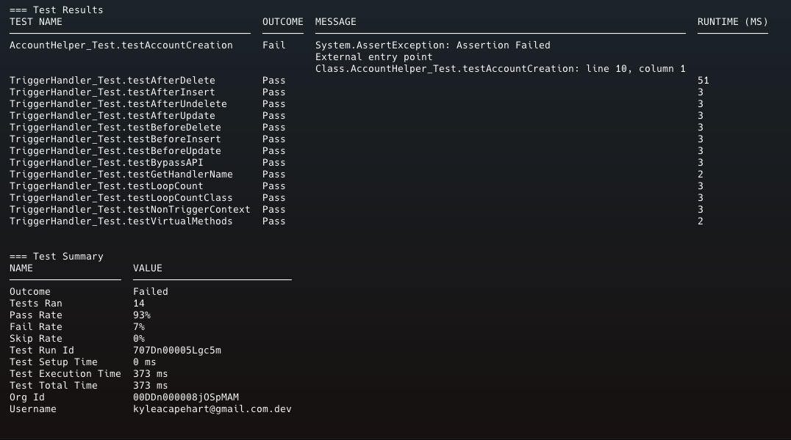
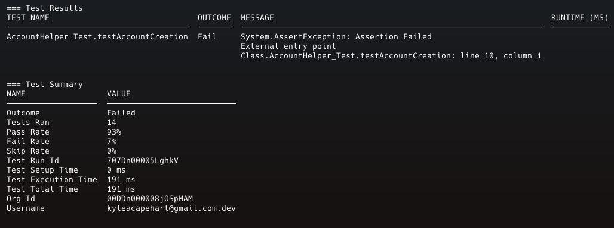

+++
title = 'Concise Apex Test Output in the CLI'
date = 2024-08-23T09:55:03-04:00
draft = false
categories = ['salesforce', 'dev-ops']
keywords = ['kyle capehart', 'salesforce', 'sf', 'sfdc', 'dev-ops', 'dev ops', 'github actions', 'automating salesforce release', 'yaml', 'gh actions', 'salesforce pipeline', 'sf release', 'salesforce cli', 'sfdx', 'ci/cd', 'ci/cd in salesforce', 'ci cd salesforce', 'sf apex run test', 'sf apex get test', 'sf apex run test --concise', 'sf apex get test --concise', '--concise', 'concise test results']
+++

Improving the developer experience when running apex tests.

The power of open source software is that it is community driven, so that anyone can make meaningful contributions, even when that contribution feels small.

One example of this is my recent contribution to the Salesforce CLI to improve apex test result output. I was unhappy with the current state. Every test method's result is outputted to the terminal, whether it succeeds or fails. So if you have many tests this would require you to scroll through a lot of other results before you can pinpoint which test is the problem.

For example, here is the output of the command `sf apex run test -w5` in an org with 14 tests.

This is longer than it needs to be, and represents a fairly small org. Only 1 test is failing, but it is buried behind the passing test results. In a larger org, there could be hundreds of tests, making it very cumbersome to find the test holding up a deployment.

Searching through the CLI repo, this was brought up as a pain point at least a couple of times: [#243](https://github.com/forcedotcom/salesforcedx-apex/issues/243), [#2872](https://github.com/forcedotcom/cli/discussions/2872).

After discussing possible solutions, I took it upon myself to implement a fix by adding a new flag to the `apex run test` and `apex get test` commands: `--concise`.

Using this flag will now skip the output of passing test results and **only** display test results that failed.

Here is the output of the command `sf apex run test -w5 --concise` in the same org.

The terminal output is much easier to read, as only failures are displayed. If no tests fail, then only the Test Summary table is shown.

This feature is part of the stable release candidate for August 28th. Check out the [release notes](https://github.com/forcedotcom/cli/blob/main/releasenotes/README.md#2566-august-28-2024-stable-rc) and try it out!

 *Comments or questions? <a href="mailto: kyleacapehart@gmail.com">Send me a message</a>*