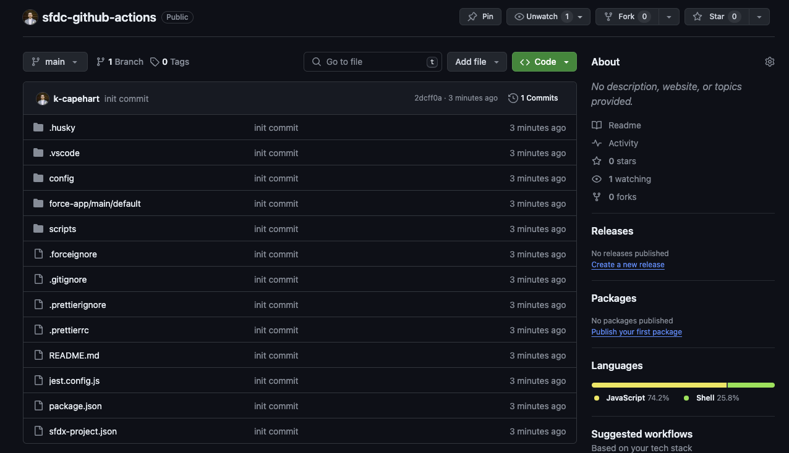
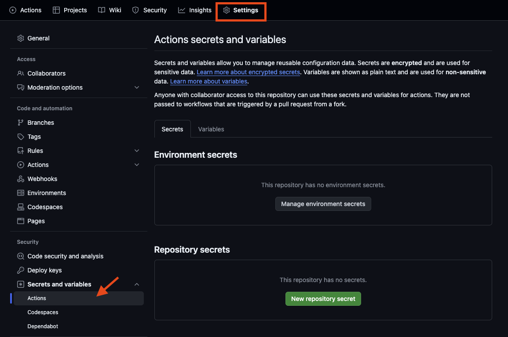
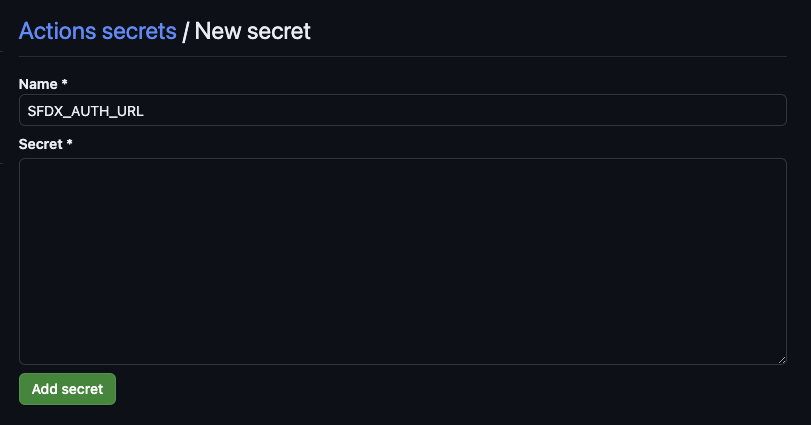
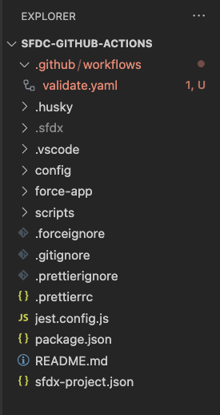
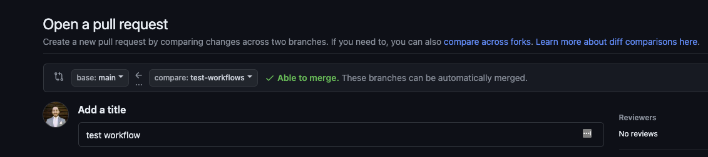
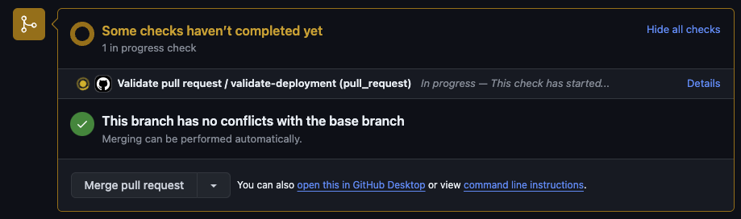
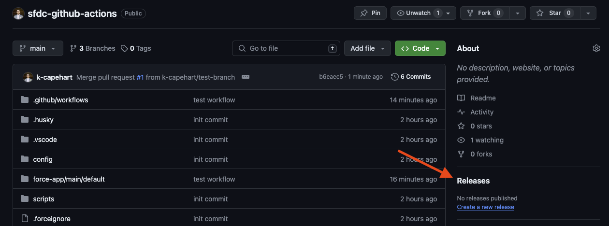
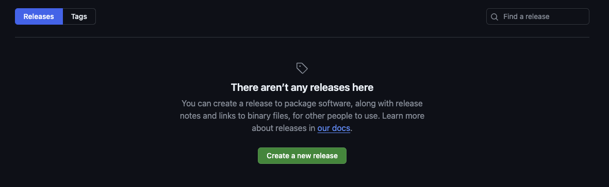
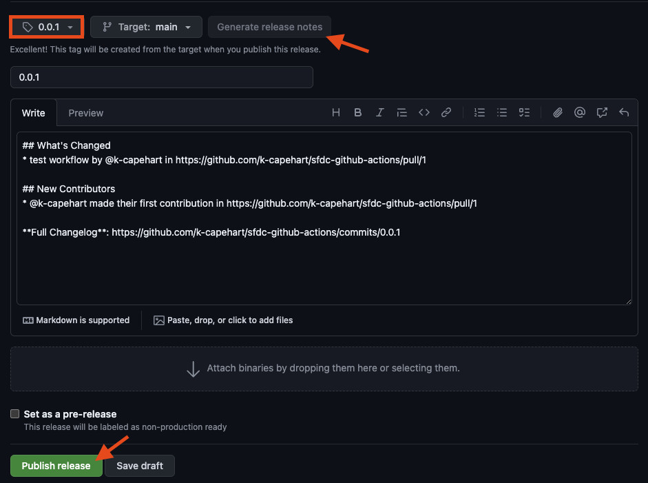
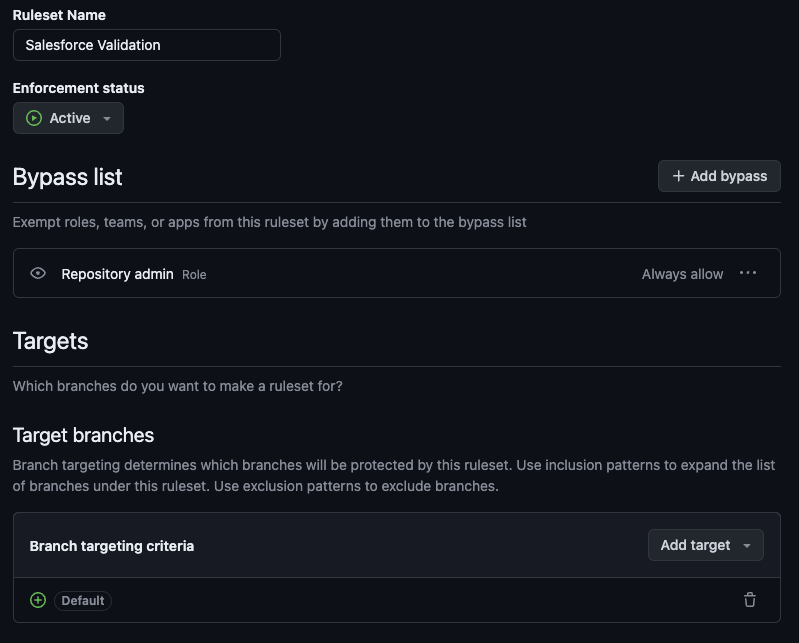

+++
title = 'Automate your Salesforce Deployments with GitHub Actions'
date = 2024-04-02T10:38:35-04:00
draft = true
categories = ['salesforce', 'dev-ops']
keywords = ['salesforce', 'sf', 'sfdc', 'dev-ops', 'dev ops', 'github actions', 'automating salesforce release', 'yaml', 'gh actions', 'salesforce pipeline', 'sf release', 'salesforce cli', 'sfdx', 'ci/cd', 'sf project deploy', 'sfdx authorization url', 'sf org login', 'sf org login sfdx-url', 'securely login salesforce', 'sf org display --verbose', 'devops center', 'change sets', 'ant migration tool retirement', 'ant migration end of life']
+++

Streamline your Salesforce release pipeline in just a few steps.

## Using the right tools
There are many tutorials that cover automating Salesforce deployments with GitHub Actions. This article's intention is to cover a few gaps and ensure release managers are using the best available tools.
- Use newer `sf-cli` over the deprecated `sfdx-cli` ([announcement](https://developer.salesforce.com/blogs/2023/07/salesforce-cli-sf-v2-is-here))
- Utilize new `sfdx-url-stdin` authorization method from [sf-cli Release 2.24.4](https://github.com/forcedotcom/cli/blob/main/releasenotes/README.md#2244-jan-17-2024) (implemented by yours truly)

## CI/CD in Salesforce
CI/CD ([continuous integration and continuous delivery/deployment](https://www.redhat.com/en/topics/devops/what-is-ci-cd)) describes the process by which software development teams quickly develop and deploy applications. In the world of Salesforce, this means being able to automate deployments from scratch orgs (and sandboxes) all the way to production.

GitHub Actions are a powerful way to automate CI/CD processes by triggering workflows based off of events (like opening a pull request or creating a release) in a GitHub repository. Read more about [GitHub Actions](https://docs.github.com/en/actions/learn-github-actions).

The `sf-cli` is Salesforce's powerful new command line interface that supports running tests, deploying metadata, and more. Workflows can automatically run `sf-cli` commands so that developers no longer have to manually execute deployments, enabling [source-driven development](https://trailhead.salesforce.com/content/learn/modules/sfdx_dev_model/sfdx_dev_model_sdd).


## Creating a workflow using GitHub Actions
By the end of this tutorial you should have the following configurations to power your Salesforce releases:
1. A workflow to validate metadata when a pull request is opened
2. A workflow to deploy metadata when a release is created
3. Branch protections to ensure code must be successfully validated before merged

The source code used for this tutorial can be found here:<br/>
https://github.com/k-capehart/sfdc-github-actions

### What you need
This article assumes that you have basic knowledge of Salesforce and working within a GitHub repository. Here are a few prerequisites, all entirely free.
- [Salesforce Developer Edition org](https://developer.salesforce.com/signup)
- [GitHub account](https://github.com/join) with a fresh repository containing your Salesforce metadata
- [Salesforce Command Line Interface](https://developer.salesforce.com/tools/salesforcecli)
    - If you are using the old `sfdx-cli`, [upgrade to the new `sf-cli`](https://developer.salesforce.com/docs/atlas.en-us.sfdx_setup.meta/sfdx_setup/sfdx_setup_move_to_sf_v2.htm)
- [Visual Studio Code with Salesforce Extension Pack](https://developer.salesforce.com/tools/vscode)
    - Learn how to setup your [Salesforce Developer Environment in VS Code](https://trailhead.salesforce.com/content/learn/projects/quickstart-vscode-salesforce)

### 1. Setup

This assumes that you already have a Salesforce project created and setup in Visual Studio Code. Review the prerequisites above if not. A fresh Salesforce project should look something like this in GitHub.



### 2. SFDX Authorization URL

A GitHub workflow must be able to authenticate to an org in order to deploy metadata. In a production environment a Service User should be used so that permissions are delineated.

Ensure that your VS Code project is authenticated to your Salesforce org with the user that should run deployments.<br/>
`sf org login web`.

Once connected, you will need the SFDX Authorization URL.<br/>
`sf org display --verbose`.

The output will display sensitive information regarding your Salesforce org. This should **never** be shared. Fortunately, GitHub provides a simple way to securely store tokens that can be accessed from workflows. 

First, copy the value for `Sfdx Auth Url` from the output of the previous command.

In your GitHub repository, go to "Settings" then "Secrets and variables" and "Actions".



Click on "New repository secret". Note that Environment secrets can also be created to manage credentials for different Salesforce environments.

Name the secret `SFDX_AUTH_URL`, then paste the `Sfdx Auth Url` value from the output of `sf org display --verbose` into the secret. Then click "Add secret".



### 3. Create validation workflow

At the root of your VS Code project, create a directory and sub directory: `.github/workflows/`. 

Within the new `workflow/` directory create a new file: `validate.yaml`. 

Your folder structure in VS Code should now look something like this.



Paste the following code into `validate.yaml`.

```yaml
name: Validate pull request

on:
  pull_request:
    branches:
      - main
    types: [opened, synchronize]
    paths:
      - 'force-app/**'

jobs:
  validate-deployment:
    runs-on: ubuntu-latest
    container:
      image: salesforce/cli:latest-slim
    steps:      
      - name: 'Checkout source code'
        uses: actions/checkout@v4
        with:
          fetch-depth: 0
      
      - name: 'Authenticate using SFDX_AUTH_URL'
        shell: bash
        run: | 
          echo ${{ secrets.SFDX_AUTH_URL }} | sf org login sfdx-url -s -u

      - name: 'Validate'
        run: |
          sf project deploy validate -d force-app/ -l RunLocalTests -w 30
```

Let's break this down.

```yaml
name: Validate pull request

on:
  pull_request:
    branches:
      - main
    types: [opened, synchronize]
    paths:
      - 'force-app/**'
```
This names the workflow "Validate pull request" and defines it to be triggered on the following events:
- a pull request is opened against the main branch
- a pull request against the main branch is updated to reflect new changes

It also limits it to the `force-app/` file path, which is where deployable metadata is located in a Salesforce project. That way validations aren't triggered if an update is made to any other component, like the README.

```yaml
jobs:
  validate-deployment:
    runs-on: ubuntu-latest
    container:
        image: salesforce/cli:latest-slim
```
This creates a new job called `validate deployment` which runs in a Ubuntu virtual machine server. The runner includes an image of the `sf-cli`, whatever the latest version is. This allows the job to execute `sf` commands.

```yaml
    steps:      
      - name: 'Checkout source code'
        uses: actions/checkout@v4
        with:
          fetch-depth: 0
```
The first step within the job is to use an action to checkout the source code. This allows the workflow to access the files in the repository. `fetch-depth: 0` lets it fetch the entire commit history.

```yaml
      - name: 'Authenticate using SFDX_AUTH_URL'
        shell: bash
        run: | 
          echo ${{ secrets.SFDX_AUTH_URL }} | sf org login sfdx-url -s -u
```
Next, the workflow has to authenticate into the target environment.

- `echo ${{ secrets.SFDX_AUTH_URL }} |` - access the SFDX_AUTH_URL from the GitHub repository and pipe it into the next command
- `sf org login sfdx-url` - authorize an org using Salesforce DX authorization URL
    - `-s` - set the org as the default that all org-related commands run against
    - `-u` - indicates that the authorization URL will be piped in

Read more about [authentication using the SFDX Authorization URL](https://developer.salesforce.com/docs/atlas.en-us.sfdx_cli_reference.meta/sfdx_cli_reference/cli_reference_org_commands_unified.htm#cli_reference_org_login_sfdx-url_unified) in official documentation.

```yaml
      - name: 'Validate'
        run: |
          sf project deploy validate -d force-app/ -l RunLocalTests -w 30
```
Finally, validate the metadata against the authenticated environment.

- `sf project deploy validate` - validate a metadata deployment without actually executing it
    - `-d force-app/` - path to the source files to be deployed
    - `-l RunLocalTests` - all tests in your org are run, except tests from packages
    - `-w 30` - wait 30 minutes to finish before displaying results 

### 4. Create release workflow

Create a new file in `.github/workflows/`: `release.yaml`.

Paste the following code into `release.yaml`.

```yaml
name: Deploy project

on:
  release:
    types: [published]

jobs:
  deploy-release:
    runs-on: ubuntu-latest
    container:
      image: salesforce/cli:latest-slim
    steps:
      - name: 'Checkout source code'
        uses: actions/checkout@v3
        with:
          fetch-depth: 0
            
      - name: 'Authenticate using SFDX_AUTH_URL'
        shell: bash
        run: |
          echo ${{ secrets.SFDX_AUTH_URL }} | sf org login sfdx-url -s -u

      - name: 'Deploy'
        run: |
          sf project deploy start -d force-app/ -l RunLocalTests -w 30
```

This is almost identical to `validate.yaml` but with a couple key differences.

```yaml
name: Deploy project

on:
  release:
    types: [published]
```
This names the workflow "Deploy project" and defines it to be triggered on the following event:
- a release is published

```yaml
      - name: 'Deploy'
        run: |
          sf project deploy start -d force-app/ -l RunLocalTests -w 30
```
- `sf project deploy start` - deploy metadata to an org from your local project
    - `-d force-app/` - path to the source files to be deployed
    - `-l RunLocalTests` - all tests in your org are run, except from packages
    - `-w 30` - wait 30 minutes to finish before displaying results 

Once complete, push the workflows to your GitHub repository.

### 5. Testing the workflows

#### Open a pull request
In a real working environment, development might be done in a scratch org, then pushed to GitHub so that changes can be deployed to a shared sandbox. However, that isn't strictly necessary for this tutorial.

Checkout a new branch to hold your changes.<br/>
`git checkout -b test-workflows`

Make a simple change, like creating a blank Apex Class.<br/>
`sf apex generate class -n TestApexClass -d force-app/main/default/classes`

Commit your changes and push to the branch<br/>
`git add .`<br/>
`git commit -m "test new github workflow`<br/>
`git push -u origin test-workflows`

In GitHub, create a new Pull Request, merging the `test-workflows` branch with the `main` branch.



You should see the Validate job begin to run.



Once complete, the pull request can be merged.

#### Create a release
In your GitHub repository, click on "Releases", then "Create a new release". 





Choose a tag, generally a release number (such as 0.0.1), then click "Generate release notes". Finally, click "Publish release".



The release workflow is now running, and can be viewed under the "Actions" tab.


Once complete, the Apex class will now be in your Salesforce org. 

### Setup branch protections
The workflows will now be available in your repository and will run whenever a pull request or release is created. However, validations work best when they are enforced. GitHub repositories can be setup with branch protections to ensure workflows pass before a pull request is merged.

In your GitHub repository, go to "Settings" then "Rules" and "Rulesets". 

Click on "New ruleset" and then "New branch ruleset".


Fill out the following:
- Ruleset Name: Salesforce Validation
- Enforcement status: Active
- Bypass list: Repository admin
- Target branches: Default



In the "Branch protections" section, ensure the following are selected:
- Restrict deletions
- Require a pull request before merging
    - Optionally require approvals
- Require status checks to pass
    - Require branches to be up to date before merging
    - Add "validate-deployment" check
- Block force pushes


Finally, click "Create" to enable the new protections. Salesforce must now successfully validate against the target org before it can be merged into the main branch.

## Conclusion

[Link to source code](https://github.com/k-capehart/sfdc-github-actions).