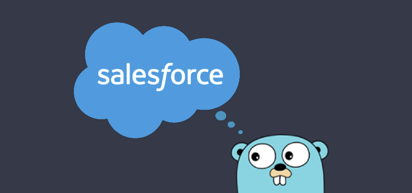

+++
title = 'Introducing go-salesforce: A Salesforce REST API wrapper written in Go'
date = 2024-05-03T10:14:32-04:00
draft = true
categories = ['salesforce']
keywords = ['kyle capehart', 'salesforce', 'sf', 'sfdc', 'go', 'golang', 'go programming language', 'go module', 'go package', 'salesforce go module', 'salesforce go package', 'salesforce rest api', 'salesforce rest api wrapper', 'salesforce rest api client', 'rest api wrapper', 'rest api client', 'salesforce data and go', 'composite api', 'bulk v2', 'go-soql', 'salesforce bulk api']
+++

Interact with your Salesforce org using Golang.

## Introduction
[go-salesforce](https://github.com/k-capehart/go-salesforce) is a new Salesforce REST API Wrapper written in [Go (golang)](https://go.dev/doc/), a statically typed, compiled programming language built by Google. It aims to make it easier for Go developers to call basic Salesforce REST API endpoints (such as authentication, querying, inserting/updating records, etc.) by wrapping these calls in methods that do all the hard work. Integrate an application into Salesforce with ease or utilize the power of Go by automating repetitive Salesforce data tasks.

Check out the repository in GitHub: [k-capehart/go-salesforce](https://github.com/k-capehart/go-salesforce)

The code is entirely open source, and is a fun side project to explore the Salesforce REST API and learn Go. Give the project a star and [create an issue](https://github.com/k-capehart/go-salesforce/issues) to start contributing.

## Features
Read the [documentation](https://pkg.go.dev/github.com/k-capehart/go-salesforce#section-readme) for a full list of features and examples.

The main use case for `go-salesforce` is performing database operations. Execute SOQL queries and insert, update, upsert, or delete sets of records. Bulk API v2 support is also available to export or load data using csv files.

### SOQL Queries
`go-salesforce` utilizes Salesforce's very own `go-soql` package for marshalling structs into SOQL. Use `soql` struct tags to construct queries and pass it to the `QueryStruct` method. This avoids the need to separately maintain SOQL queries and structs, and guards against SOQL injection. The `Query` method is also available and accepts a string parameter for the query.

Read more about `go-soql`: [forcedotcom/go-soql](https://github.com/forcedotcom/go-soql)

### Collections
Perform operations on collections of records. `go-salesforce` will split these records into batches of up to 200 and collect the results to be returned as errors if necessary. These methods are especially useful for datasets as they avoid Bulk API specific limits.

### Composite
Salesforce's Composite API allows multiple "subrequests" to be contained within a single "composite request", reducing the overall number of API calls. Up to 5000 records can be operated on at once, all within a single request to Salesforce, and without needing to use the Bulk API. Datasets larger than 5000 will need to use either the Collection of Bulk methods.

### Bulk API v2
Create jobs to asynchronously insert, update, upsert, query, or delete large datasets. This can be done either through csv files or with runtime data. You can optionally wait for jobs to finish to process potential errors, or let it run in the background and fetch the results later.

## Example - Data Transformation