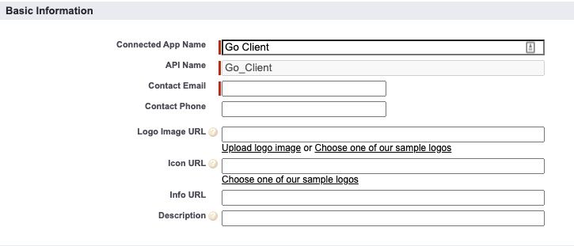
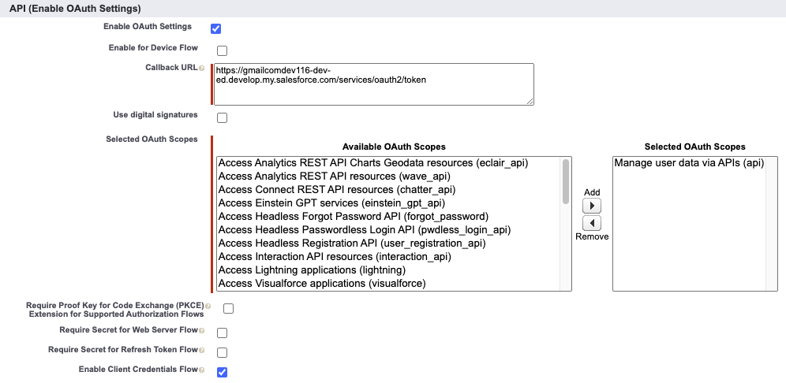
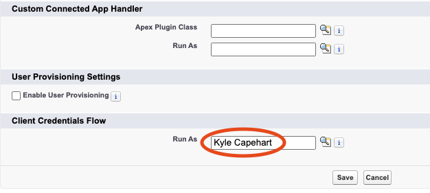

+++
title = 'Introducing go-salesforce: A Salesforce REST API wrapper written in Go'
date = 2024-05-03T10:14:32-04:00
draft = true
categories = ['salesforce']
keywords = ['kyle capehart', 'salesforce', 'sf', 'sfdc', 'go', 'golang', 'go programming language', 'go module', 'go package', 'salesforce go module', 'salesforce go package', 'salesforce rest api', 'salesforce rest api wrapper', 'salesforce rest api client', 'rest api wrapper', 'rest api client', 'salesforce data and go', 'composite api', 'bulk v2', 'go-soql', 'salesforce bulk api']
+++

Interact with your Salesforce org using Golang.


## Introduction

[go-salesforce](https://github.com/k-capehart/go-salesforce) is a new Salesforce REST API Wrapper written in [Go (golang)](https://go.dev/doc/), a statically typed, compiled programming language built by Google. It aims to make it easier for Go developers to call basic Salesforce REST API endpoints (such as authentication, querying, inserting/updating records, etc.) by wrapping these calls in methods that do the hard work. Integrate an application into Salesforce with ease or utilize the power of Go by automating repetitive Salesforce data tasks.

Check out the repository in GitHub: [k-capehart/go-salesforce](https://github.com/k-capehart/go-salesforce)

The code is entirely open source, and is a fun side project to explore the Salesforce REST API and learn Go. Give the project a star and [create an issue](https://github.com/k-capehart/go-salesforce/issues) to start contributing.

## Features

Read the [documentation](https://pkg.go.dev/github.com/k-capehart/go-salesforce#section-readme) for a full list of features and examples.

### SOQL Queries using go-soql

`go-salesforce` utilizes Salesforce's very own `go-soql` package for marshalling structs into SOQL. Use `soql` struct tags to construct queries and pass it to the `QueryStruct` method. This avoids the need to separately maintain SOQL queries and structs, and guards against SOQL injection. The `Query` method is also available and accepts a string parameter for the query.

Read more about `go-soql`: [forcedotcom/go-soql](https://github.com/forcedotcom/go-soql)

### Work with Batches of Records

Perform operations on collections of records. `go-salesforce` will split these records into batches and collect the results to be returned as errors if necessary. These methods are especially useful for datasets as they avoid Bulk API specific limits.

### Composite Requests

Salesforce's Composite API allows multiple "subrequests" to be contained within a single "composite request", reducing the overall number of API calls. Up to 5000 records can be operated in a single request without needing to use Bulk API. Datasets larger than 5000 will need to use either the Collection or Bulk methods.

### Bulk API v2

Create jobs to asynchronously insert, update, upsert, query, or delete large datasets. This can be done either through csv files or with runtime data. You can optionally wait for jobs to finish to process potential errors, or let it run in the background and fetch the results later.

## Example - Migrating Contacts

Steps are outlined below on how to create a simple `go-salesforce` utility to transfer Contacts from one Account to another. The program should:
1. Take 2 inputs: a source Account Id and a target Account Id
2. Query all the related Contacts for the given source Account
3. Update these contacts to be related to the target Account

Source code can be found here: [k-capehart/go-salesforce-example](https://github.com/k-capehart/go-salesforce-example/blob/main/migrate_contacts.go)

### 1. Create a Salesforce Connected App

This example will use the Client Credentials OAuth flow. In your Salesforce Org, navigate to Setup and search for "App Manager". Click on "New Connected App". 

Read official documentation on [creating a Connected App for OAuth 2.0 Client Credentials Flow](https://help.salesforce.com/s/articleView?id=sf.connected_app_client_credentials_setup.htm&type=5).

Fill out the following details, using your own email or that of an admin.

- Connected App Name: Go Client
- Contact Email: [your own email]
- Enable OAuth Settings: TRUE
- Callback URL: https://[your sfdc domain]/services/oauth2/token
- Selected OAuth Scopes: Manage user data via APIs (api)




Click "Save", then click on "Manage" and "Edit Policies".
Under "Client Credentials Flow", set the "Run As" user to the user that should be assigned the flow.



Click "Save", and then return to View page of the Connected App in App Manager. Note down the Consumer Key and Consumer Secret by clicking on "Managed Consumer Details".

### 2. Create a new Go Module and connect to Salesforce

In a new directory, run the following command:<br>
`go mod init main`

To install the latest version of `go-salesforce`, execute the following:<br>
`go get github.com/k-capehart/go-salesforce`

Create a new file called: `migrate_contacts.go`. Within this file, paste the following code:

```go
package main

import (
	"errors"
	"os"
)

// TODO: Type Definitions

func main() {
	args := os.Args
	if len(args) < 3 {
		panic(errors.New("expected 2 command line arguments in addition to program name"))
	}
	srcAccount := os.Args[1]
	targetAccount := os.Args[2]

    // TODO: Salesforce Authentication

    // TODO: Query Contacts

    // TODO: Update Contacts
}
```

This code uses the `os` package to read arguments from the command line. The first command (index 0) is always the program name. This expects 2 more arguments, which should be processed as Salesforce Account Ids.

More information on [creating Go Modules](https://go.dev/doc/tutorial/create-module).

Next, replace `// TODO: Salesforce Authentication` with the following code:

```go
sf, err := salesforce.Init(salesforce.Creds{
    Domain:         {YOUR SALESFORCE DOMAIN},
    ConsumerKey:    {YOUR CONNECTED APP CONSUMER KEY},
    ConsumerSecret: {YOUR CONNECTED APP CONSUMER SECRET},
})
if err != nil {
    panic(err)
}
```

This uses the `Init` method from `go-salesforce` to return a Salesforce instance using your client credentials from the previous step. Never publicly expose your ConsumerKey or Secret by securely storing credentials outside of your codebase.

### 3. Query Contacts using go-soql

There are two methods to query data using `go-salesforce`. One method would be to use the `Query` method to pass in a query as a string. However, Salesforce has created a package specifically marshalling SOQL queries. Read more about [go-soql](https://github.com/forcedotcom/go-soql).

Replace `// TODO: Type Definitions` with the following type definitions:

```go
type Contact struct {
	Id        string `soql:"selectColumn,fieldName=Id" json:"Id"`
	AccountId string `soql:"selectColumn,fieldName=AccountId" json:"AccountId"`
}

type ContactQueryCriteria struct {
	AccountId string `soql:"equalsOperator,fieldName=AccountId"`
}

type ContactSoqlQuery struct {
	SelectClause Contact              `soql:"selectClause,tableName=Contact"`
	WhereClause  ContactQueryCriteria `soql:"whereClause"`
}
```

Replace `// TODO: Query Contacts` with this code:

```go
contacts := []Contact{}
contactSoqlQuery := ContactSoqlQuery{
    SelectClause: Contact{},
    WhereClause: ContactQueryCriteria{
        AccountId: srcAccount,
    },
}
err = sf.QueryStruct(contactSoqlQuery, &contacts)
if err != nil {
    panic(err)
}
```

`contactSoqlQuery` represents a SOQL query that selects the `Id` and `AccountId` fields, with a filter based on the given `AccountId`. The result is then unmarshalled into a slice of type `Contact`. This is useful because you don't have to separately maintain a query and a SObject type. The selected fields are always the same as the properties on the struct.

### 4. Update Contact records

Next, the program should process the contacts and update the `AccountId` field.

Replace `// TODO: Update Contacts` with the last bit of code.
```go
for i := range contacts {
    contacts[i].AccountId = targetAccount
}
logger := log.New(os.Stdout, "INFO: ", log.Ldate|log.Ltime)
err = sf.UpdateCollection("Contact", contacts, 200)
if err != nil {
    logger.Fatal(err.Error())
}
logger.Print("successfully updated " + strconv.Itoa(len(contacts)) + " contacts")
```

This loops through the contacts variable that was populated from the query, and updates the `AccountId` to be that of the target account. The list is then passed as an argument to the `UpdateCollection()` method. The batch size is given as 200 but can be adjusted anywhere in the range of 1-200. If everything succeeds, then log how many Contacts were updated.

### 5. Run the program

The final code should look like this:

```go
package main

import (
	"errors"
	"log"
	"os"
	"strconv"

	"github.com/k-capehart/go-salesforce"
)

type Contact struct {
	Id        string `soql:"selectColumn,fieldName=Id" json:"Id"`
	AccountId string `soql:"selectColumn,fieldName=AccountId" json:"AccountId"`
}

type ContactQueryCriteria struct {
	AccountId string `soql:"equalsOperator,fieldName=AccountId"`
}

type ContactSoqlQuery struct {
	SelectClause Contact              `soql:"selectClause,tableName=Contact"`
	WhereClause  ContactQueryCriteria `soql:"whereClause"`
}

func main() {
	args := os.Args
	if len(args) < 3 {
		panic(errors.New("expected 2 command line arguments in addition to program"))
	}
	srcAccount := os.Args[1]
	targetAccount := os.Args[2]

    sf, err := salesforce.Init(salesforce.Creds{
        Domain:         {YOUR SALESFORCE DOMAIN},
        ConsumerKey:    {YOUR CONNECTED APP CONSUMER KEY},
        ConsumerSecret: {YOUR CONNECTED APP CONSUMER SECRET},
    })
	if err != nil {
		panic(err)
	}

	contacts := []Contact{}
	contactSoqlQuery := ContactSoqlQuery{
		SelectClause: Contact{},
		WhereClause: ContactQueryCriteria{
			AccountId: srcAccount,
		},
	}
	err = sf.QueryStruct(contactSoqlQuery, &contacts)
	if err != nil {
		panic(err)
	}

	for i := range contacts {
		contacts[i].AccountId = targetAccount
	}
	logger := log.New(os.Stdout, "INFO: ", log.Ldate|log.Ltime)
	err = sf.UpdateCollection("Contact", contacts, 200)
	if err != nil {
		logger.Fatal(err.Error())
	}
	logger.Print("successfully updated " + strconv.Itoa(len(contacts)) + " contacts")
}
```

Source code: [k-capehart/go-salesforce-example](https://github.com/k-capehart/go-salesforce-example/blob/main/migrate_contacts.go)

Now that the code is complete, it can be executed. From the command line, build the package.<br>
`go build migrate_contacts.go`

Then run the program, replacing the Salesforce IDs below with those of Account Ids in your Salesforce org.<br>
`./migrate_contacts 001Dn000013hAraIAE 001Dn00000NTt34IAD`

