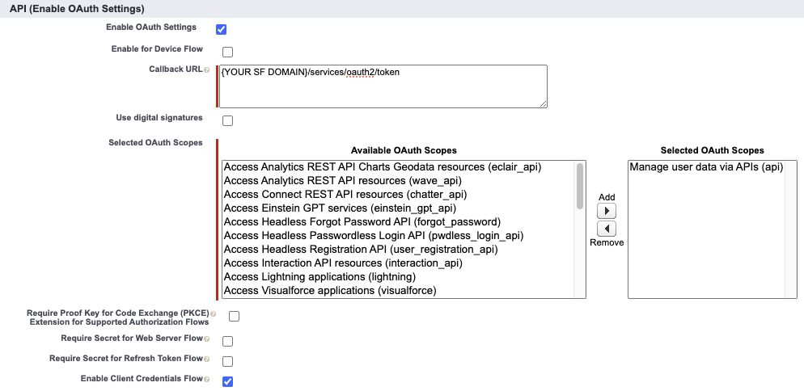

+++
title = 'Introducing go-salesforce: A Salesforce REST API wrapper written in Go'
date = 2024-05-03T10:14:32-04:00
draft = false
categories = ['salesforce']
keywords = ['kyle capehart', 'salesforce', 'sf', 'sfdc', 'go', 'golang', 'go programming language', 'go module', 'go package', 'salesforce go module', 'salesforce go package', 'salesforce rest api', 'salesforce rest api wrapper', 'salesforce rest api client', 'rest api wrapper', 'rest api client', 'salesforce data and go', 'composite api', 'bulk v2', 'go-soql', 'salesforce bulk api', 'go salesforce', 'golang salesforce', 'go salesforce module', 'go-salesforce', 'salesforce-go', 'connect to salesforce with go', 'golang salesforce rest api', 'golang sfdc rest api', 'go salesforce rest api', 'go sfdc rest api', 'golang rest api wrapper for salesforce', 'go rest api wrapper for sfdc', 'salesforce bulk api in golang', 'login to salesforce with golang', 'go salesforce api', 'go sfdc api' , 'golang salesforce api' , 'go sfdc api', 'update salesforce with golang', 'automate salesforce data tasks with golang', 'automate salesforce tasks with go']
+++

Interact with your Salesforce org using Golang.


## Introduction

[go-salesforce](https://github.com/k-capehart/go-salesforce) is a new Salesforce REST API wrapper written in [Go (golang)](https://go.dev/doc/), a statically typed, compiled programming language built by Google. It aims to make it easier for Go developers to call Salesforce REST API endpoints (such as authentication, querying, inserting/updating records, etc.) by wrapping these calls in methods that do all the hard work. Integrate an application into Salesforce with ease or utilize the power of Go by automating repetitive data tasks.

Check out the repository in GitHub: [k-capehart/go-salesforce](https://github.com/k-capehart/go-salesforce)

The code is entirely open source, and was created as a fun side project to explore the Salesforce REST API and learn Go. Give the project a star and [create an issue](https://github.com/k-capehart/go-salesforce/issues) to start contributing.

## Features

Read the [documentation](https://pkg.go.dev/github.com/k-capehart/go-salesforce#section-readme) for a full list of features and examples.

### SOQL Queries using go-soql

`go-salesforce` utilizes Salesforce's very own `go-soql` package for marshalling structs into SOQL. Use `soql` struct tags to construct queries and pass it to the `QueryStruct` method. This avoids the need to separately maintain SOQL queries and structs, and guards against SOQL injection. The `Query` method is also available and accepts a string parameter for the query.

Read more about `go-soql`: [forcedotcom/go-soql](https://github.com/forcedotcom/go-soql)

### Work with Batches of Records

Perform operations on collections of records. `go-salesforce` will split these records into batches and collect the results to be returned as errors if necessary. Insert, update, or delete large collections of records while avoiding Bulk API specific limits in your org. Set the batch size for full control on how Salesforce processes the data.

Read about [Salesforce API Limits](https://developer.salesforce.com/docs/atlas.en-us.salesforce_app_limits_cheatsheet.meta/salesforce_app_limits_cheatsheet/salesforce_app_limits_platform_api.htm), and [Bulk API Limits](https://developer.salesforce.com/docs/atlas.en-us.salesforce_app_limits_cheatsheet.meta/salesforce_app_limits_cheatsheet/salesforce_app_limits_platform_bulkapi.htm).

### Composite Requests

[Salesforce's Composite API](https://developer.salesforce.com/docs/atlas.en-us.api_rest.meta/api_rest/resources_composite_composite_post.htm) allows multiple "subrequests" to be contained within a single "composite request", reducing the overall number of API calls. Up to 5000 records can be included in a single composite request. Datasets larger than 5000 will need to use either the Collection or Bulk methods.

Salesforce also supports dependent subrequests. For example, you can Insert a new Account and multiple child records associated with the Account all within the same request. This is very powerful and will be built upon in `go-salesforce`.

### Bulk API v2

Create jobs to asynchronously insert, update, upsert, query, or delete large datasets. This can be done either through csv files or with runtime data. You can optionally wait for jobs to finish to process potential errors, or let it run in the background and fetch the results later.

A common use case is to have predefined test data within a csv file that needs to be loaded into a Salesforce sandbox after a refresh. With `go-salesforce` you can automate this data loading process in just a few lines using the `InsertBulkFile` method.

## Example - Migrating Contacts

Steps are outlined below on how to create a simple `go-salesforce` utility to transfer Contacts from one Account to another. The program should:
1. Take 2 inputs: a source Account Id and a target Account Id
2. Query all the related Contacts for the given source Account
3. Update these contacts to be related to the target Account

Source code can be found here: [k-capehart/go-salesforce-example](https://github.com/k-capehart/go-salesforce-example/blob/main/migrate_contacts.go)

Prerequisites:
- [Salesforce Developer Edition org](https://developer.salesforce.com/signup)
- Basic knowledge of Salesforce and Golang

### 1. Create a Salesforce Connected App

This example will use the Client Credentials OAuth flow. Read official documentation on [creating a Connected App for OAuth 2.0 Client Credentials Flow](https://help.salesforce.com/s/articleView?id=sf.connected_app_client_credentials_setup.htm&type=5).

In your Salesforce Org, navigate to Setup and search for "App Manager". Click on "New Connected App". 


Fill out the following details, using your own email or that of an admin.

- Connected App Name: Go Client
- Contact Email: [your own email]
- Enable OAuth Settings: TRUE
- Callback URL: https://[YOUR SF DOMAIN]/services/oauth2/token
- Selected OAuth Scopes: Manage user data via APIs (api)
- Enable Client Credentials Flow: TRUE




Click "Save", then click on "Manage" and "Edit Policies".
Under "Client Credentials Flow", set the "Run As" user to the user that should be authenticated.


Click "Save", and then return to the View page of the Connected App in App Manager. Note down the Consumer Key and Consumer Secret by clicking on "Manage Consumer Details".

### 2. Create a new Go Module and connect to Salesforce

In a new directory, run the following command:<br>
`go mod init main`

To install the latest version of `go-salesforce`, execute the following:<br>
`go get github.com/k-capehart/go-salesforce`

Create a new file called: `migrate_contacts.go`. Within this file, paste the following code:

```go
package main

import (
	"errors"
	"os"
)

// TODO: Type Definitions

func main() {
	args := os.Args
	if len(args) < 3 {
		panic(errors.New("expected 2 command line arguments in addition to program name"))
	}
	srcAccount := os.Args[1]
	targetAccount := os.Args[2]

    // TODO: Salesforce Authentication

    // TODO: Query Contacts

    // TODO: Update Contacts
}
```

This code uses the `os` package to read arguments from the command line. The first command (index 0) is always the program name. This expects 2 more arguments, which should be processed as Salesforce Account Ids.

More information on [creating Go Modules](https://go.dev/doc/tutorial/create-module).

Next, replace `// TODO: Salesforce Authentication` with the following code:

```go
sf, err := salesforce.Init(salesforce.Creds{
    Domain:         {YOUR SALESFORCE DOMAIN},
    ConsumerKey:    {YOUR CONNECTED APP CONSUMER KEY},
    ConsumerSecret: {YOUR CONNECTED APP CONSUMER SECRET},
})
if err != nil {
    panic(err)
}
```

This uses the `Init` method from `go-salesforce` to return a Salesforce instance using your client credentials from the previous step. Never publicly expose your ConsumerKey or Secret. Always securely store credentials outside of your codebase before committing to a repository.

### 3. Query Contacts using go-soql

There are two options to query data using `go-salesforce`. One option would be to use the `Query` method to pass in a query as a string. However, Salesforce has created a package specifically for marshalling SOQL queries which will be utilized for this example. Read more about [go-soql](https://github.com/forcedotcom/go-soql).

Replace `// TODO: Type Definitions` with the following type definitions:

```go
type Contact struct {
	Id        string `soql:"selectColumn,fieldName=Id" json:"Id"`
	AccountId string `soql:"selectColumn,fieldName=AccountId" json:"AccountId"`
}

type ContactQueryCriteria struct {
	AccountId string `soql:"equalsOperator,fieldName=AccountId"`
}

type ContactSoqlQuery struct {
	SelectClause Contact              `soql:"selectClause,tableName=Contact"`
	WhereClause  ContactQueryCriteria `soql:"whereClause"`
}
```

Note the `soql` struct tags that inform `go-soql` how to transform these structs into queries.

Replace `// TODO: Query Contacts` with this code:

```go
contacts := []Contact{}
contactSoqlQuery := ContactSoqlQuery{
    SelectClause: Contact{},
    WhereClause: ContactQueryCriteria{
        AccountId: srcAccount,
    },
}
err = sf.QueryStruct(contactSoqlQuery, &contacts)
if err != nil {
    panic(err)
}
```

`contactSoqlQuery` represents a SOQL query that selects the `Id` and `AccountId` fields, with a filter for `AccountId`. The `SELECT` clause is simply the fields from the `Contact` struct. The result is then unmarshalled into a slice of type `Contact`. This is useful because you don't have to separately maintain a query and a SObject type, since the fields are all pulled from the same definition.

### 4. Update Contact records

Next, the program should process the contacts and update the `AccountId` field.

Replace `// TODO: Update Contacts` with the last bit of code.
```go
for i := range contacts {
    contacts[i].AccountId = targetAccount
}
logger := log.New(os.Stdout, "INFO: ", log.Ldate|log.Ltime)
err = sf.UpdateCollection("Contact", contacts, 200)
if err != nil {
    logger.Fatal(err.Error())
} else {
	logger.Print("successfully updated " + strconv.Itoa(len(contacts)) + " contacts")
}
```

This loops through the `contacts` variable that was populated from the query, and updates the `AccountId` value to be that of the target account. The list is then passed as an argument to the `UpdateCollection` method. The batch size is given as 200 but can be adjusted anywhere in the range of 1-200. If everything succeeds, then log how many Contacts were updated.

### 5. Run the program

The final code should look like this, but with your own org credentials:

```go
package main

import (
	"errors"
	"log"
	"os"
	"strconv"

	"github.com/k-capehart/go-salesforce"
)

type Contact struct {
	Id        string `soql:"selectColumn,fieldName=Id" json:"Id"`
	AccountId string `soql:"selectColumn,fieldName=AccountId" json:"AccountId"`
}

type ContactQueryCriteria struct {
	AccountId string `soql:"equalsOperator,fieldName=AccountId"`
}

type ContactSoqlQuery struct {
	SelectClause Contact              `soql:"selectClause,tableName=Contact"`
	WhereClause  ContactQueryCriteria `soql:"whereClause"`
}

func main() {
	args := os.Args
	if len(args) < 3 {
		panic(errors.New("expected 2 command line arguments in addition to program"))
	}
	srcAccount := os.Args[1]
	targetAccount := os.Args[2]

    sf, err := salesforce.Init(salesforce.Creds{
        Domain:         {YOUR SALESFORCE DOMAIN},
        ConsumerKey:    {YOUR CONNECTED APP CONSUMER KEY},
        ConsumerSecret: {YOUR CONNECTED APP CONSUMER SECRET},
    })
	if err != nil {
		panic(err)
	}

	contacts := []Contact{}
	contactSoqlQuery := ContactSoqlQuery{
		SelectClause: Contact{},
		WhereClause: ContactQueryCriteria{
			AccountId: srcAccount,
		},
	}
	err = sf.QueryStruct(contactSoqlQuery, &contacts)
	if err != nil {
		panic(err)
	}

	for i := range contacts {
		contacts[i].AccountId = targetAccount
	}
	logger := log.New(os.Stdout, "INFO: ", log.Ldate|log.Ltime)
	err = sf.UpdateCollection("Contact", contacts, 200)
	if err != nil {
		logger.Fatal(err.Error())
	} else {
		logger.Print("successfully updated " + strconv.Itoa(len(contacts)) + " contacts")
	}
}
```

Source code: [k-capehart/go-salesforce-example](https://github.com/k-capehart/go-salesforce-example/blob/main/migrate_contacts.go)

Now that the code is complete, it can be executed. From the command line, build the package.<br>
`go build migrate_contacts.go`

Run the program, replacing the Salesforce IDs below with those of Account Ids in your Salesforce org. The first Id is the Account with Contacts that should migrate to the second Account.<br>
`./migrate_contacts 001Dn000013hAraIAE 001Dn00000NTt34IAD`

